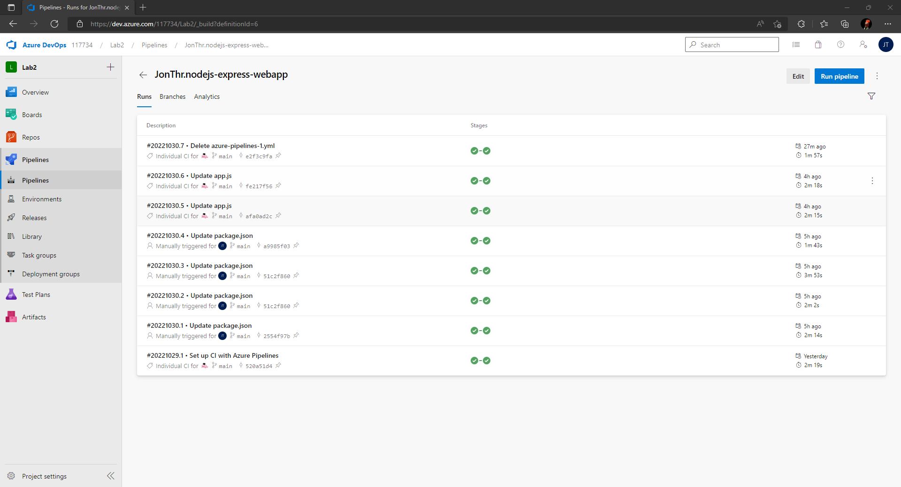
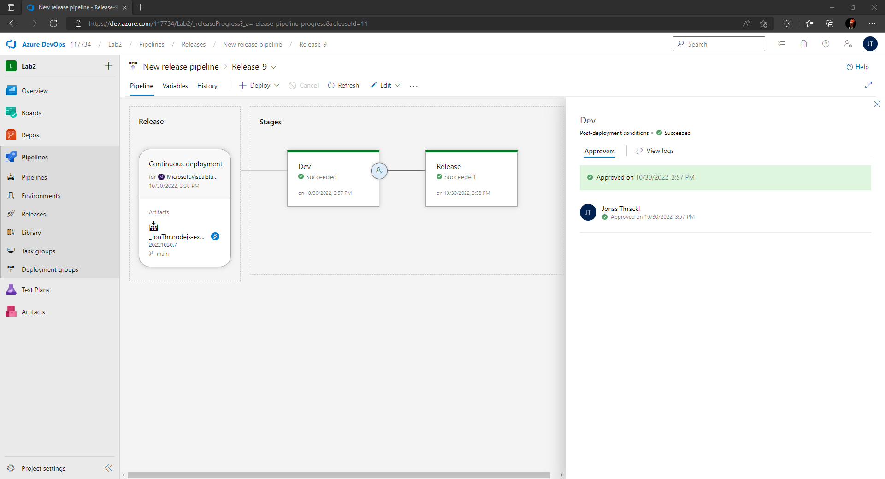

# Lab 2
Task for Lab 2:
- Building a DevOps pipeline based on Azure DevOps using a Node.js example.

## Node.js Express Webapp
https://github.com/JonThr/nodejs-express-webapp

## Azure Web Apps 
- **Development**: https://jonthrlab2-dev.azurewebsites.net
- **Production** (Release): https://jonthrlab2-release.azurewebsites.net

## Stages
### Build
The following screenshot shows the **build process**.

### Deploy
The following screenshot shows the **deploy process**.

## Deployments
The following screenshot shows the **successful** and **unsuccessful deployments**.

## Release Pipeline
The following screenshot shows the **release pipeline**.

## Application Insights
The following screenshot shows the __integration of the app in Azure Application Insights__.

## Experience
First of all, creating a new release pipeline made some problems, because the dropdown for the app service name shows "*No Results Found*". The solution to this problem was to wait a while after Azure DevOps updates the dropdown menu.

I struggled also with the deployment of the app. The deployment was successful, but the websites for development and production were not working. The error message on both websites was "*:( Application Error*". The solution was to create no folders in the repository, where the files are located. For example:

**Example 1**  

    .               
    ├── Application              
    │   ├── app.js
    │   ├── package.json
    │   └── ... 
    └── README.md
    
The above structure **did not work** for my webapp deployment. 

**Example 2**

    .                
    ├── app.js             
    ├── package.json            
    ├── README.md  
    └── ...  
    
The above structure **worked** for my webapp deployment. 

## Release documentation
A commit to the main branch of this repository will trigger a new release. The pipeline will build the app. After that the pipeline will run the tests and if all tests pass, an approver must approve this changes. If the approver approves, the app will be deployed. If the approver rejects, the app will not be deployed.

## References
https://expressjs.com/en/starter/installing.html 
https://www.youtube.com/watch?v=BAFCiiOAXB8 
https://learn.microsoft.com/en-us/azure/devops/pipelines/create-first-pipeline?view=azure-devops&tabs=java%2Ctfs-2018-2%2Cbrowser 
https://learn.microsoft.com/en-us/azure/devops/pipelines/release/triggers?view=azure-devops#release-triggers 
