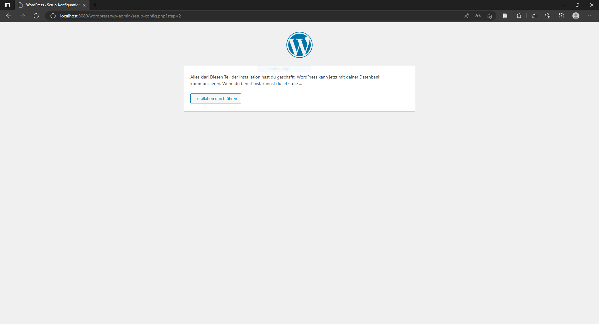

# Lab 3
Task for Lab 3:
- Set up WordPress with external MySQL database in two containers. This task consists of two parts. In each of the parts, the software is made available by containers, whereby the containers in Part 2 must be created by yourself.

## Part 1

This guide demonstrates how to use Docker-Compose to set up and run WordPress and MySQL images. Before starting, make sure you have [Docker-Compose installed](https://docs.docker.com/compose/install/).

<details>
  <summary>Click to expand!</summary>
  
### Define the project

1.  Create an empty project directory.

    This project directory contains a `docker-compose.yml` file.

    >**Tip**: You can use either a `.yml` or `.yaml` extension for
    this file. They both work.

3.  Change into your project directory.

    For example, if you named your directory `Teil1`:

    ```console
    $ cd Teil1
    ```

4.  Create a `docker-compose.yml` file that starts
    `WordPress` and a `MySQL` instance:

	```yaml
	services:
	  db:
	    image: mysql:8.0.27
	    command: '--default-authentication-plugin=mysql_native_password'
	    volumes:
	      - db_data:/var/lib/mysql
	    restart: always
	    environment:
	      - MYSQL_ROOT_PASSWORD=somewordpress
	      - MYSQL_DATABASE=wordpress
	      - MYSQL_USER=wordpress
	      - MYSQL_PASSWORD=wordpress
	    expose:
	      - 3306
	      - 33060
	  wordpress:
	    image: wordpress:latest
	    depends_on:
	      - db
	    ports:
	      - 8000:80
	    restart: always
	    environment:
	      - WORDPRESS_DB_HOST=db:3306
	      - WORDPRESS_DB_USER=wordpress
	      - WORDPRESS_DB_PASSWORD=wordpress
	      - WORDPRESS_DB_NAME=wordpress
	volumes:
	  db_data:
	```

	   > **Note**: The docker volume `db_data` persists updates made by WordPress
	   to the database.


### Build the project

Now, run `docker compose up -d` from your project directory.


### Bring up WordPress in a web browser

At this point, WordPress should be running on port `8000` of your Docker Host,
and now you can open [http://localhost:8000](http://localhost:8000) in a web
browser.

> **Note**: If you get the error response from daemon: Ports are not available: exposing port TCP 0.0.0.0:80 -> 0.0.0.0:0: listen tcp 0.0.0.0:80: bind: An attempt was made to access a socket in a way forbidden by its access permissions then change the ports in the docker-compose.yml file.

<p align="center">

</p>

<p align="center">

</p>

### Shutdown and cleanup

The command `docker compose down` removes the
containers and default network, but preserves your WordPress database.

The command `docker compose down --volumes` removes the containers, default
network, and the WordPress database.

## Usefull Links

* [Quickstart: Compose and WordPress](https://github.com/docker/awesome-compose/tree/master/official-documentation-samples/wordpress)
* [Install Docker Compose](https://www.youtube.com/watch?v=Vxf3qtk1qIA)
* [Wordpress & Docker](https://gist.github.com/bradtraversy/faa8de544c62eef3f31de406982f1d42)
</details>

## Part 2

This guide demonstrates how to create Dockerfiles for MySQL and WordPress manually and use Docker-Compose to set up and run WordPress and MySQL images. Before starting, make sure you have [Docker-Compose installed](https://docs.docker.com/compose/install/).

<details>
  <summary>Click to expand!</summary>
  
### Define the project

1.  Create an empty project directory.

    This project directory contains a `docker-compose.yml` file, a `MySQL folder` and a `Wordpress folder`. Moreover, the MySQL folder and the Wordpress folder contain a `Dockerfile`.

    >**Tip**: You can use either a `.yml` or `.yaml` extension for
    this file. They both work.
    
5.  Change into your main project directory.

    For example, if you named your directory`Teil2`:

    ```console
    $ cd Teil2
    ```
    
3.  Change into the MySQL folder.

    For example, if you named your folder`MySQL `:

    ```console
    $ cd MySQL
    ```
4.  Create a `Dockerfile` for `MySQL`:
	```Dockerfile
	FROM debian:jessie

	RUN DEBIAN_FRONTEND=noninteractive
	ENV container docker

	ENV MYSQL_ROOT_PASSWORD=somewordpress
	ENV MYSQL_DATABASE=wordpress
	ENV MYSQL_USER=wordpress
	ENV MYSQL_PASSWORD=wordpress

	RUN apt update
	RUN apt upgrade
	RUN apt install -y wget
	RUN apt install -y lsb-release
	RUN wget http://repo.mysql.com/mysql-apt-config_0.8.9-1_all.deb
	RUN dpkg -i mysql-apt-config_0.8.9-1_all.deb
	RUN echo "mysql-server mysql-server/root_password password $MYSQL_ROOT_PASSWORD" | debconf-set-	selections
	RUN echo "mysql-server mysql-server/root_password_again password $MYSQL_ROOT_PASSWORD" | debconf-	set-selections
	RUN apt install -y --force-yes mysql-server
	RUN sed -i "s/.*bind-address.*/bind-address = 0.0.0.0/" /etc/mysql/my.cnf

	VOLUME ["/var/lib/mysql/"]

	EXPOSE 3306/tcp

	CMD service mysql start && mysql --user=root --password=$MYSQL_ROOT_PASSWORD -e "CREATE USER 	'${MYSQL_USER}'@'%' IDENTIFIED BY '${MYSQL_PASSWORD}';" || true && \
	mysql --user=root --password=$MYSQL_ROOT_PASSWORD -e "CREATE DATABASE IF NOT EXISTS 		${MYSQL_DATABASE};" && \
	mysql --user=root --password=$MYSQL_ROOT_PASSWORD -e "GRANT all privileges ON 	${MYSQL_DATABASE}.* TO '${MYSQL_USER}'@'%';" \
	mysql --user=root --password=$MYSQL_ROOT_PASSWORD -e "flush privileges;" && \
	mysqld
	```   

5.  Change into your main project directory and change into your `Wordpress` folder.

    For example, if you named your folder`Wordpress`:

    ```console
    $ cd ..
    $ cd Wordpress
    ```
6.  Create a `Dockerfile` for `Wordpress`:
	```Dockerfile
	FROM debian:jessie

	ENV DEBIAN_FRONTEND noninteractive
	ENV container docker

	RUN apt update
	RUN apt upgrade

	RUN apt install -y wget
	RUN apt install -y apache2
	RUN apt install -y php5 libapache2-mod-php5 php5-mcrypt php5-mysql

	RUN apt install unzip -y

	RUN cd /var/www/html && \
	    wget https://wordpress.org/latest.zip && \
	    unzip -q latest.zip && \
	    chown -R www-data:www-data /var/www/html/wordpress && \
	    chmod -R 755 /var/www/html/wordpress && \
	    mkdir -p /var/www/html/wordpress/wp-content/uploads && \
	    chown -R www-data:www-data /var/www/html/wordpress/wp-content/uploads && \
	    rm latest.zip

	EXPOSE 80
	VOLUME ["/var/www/html"]
	CMD apachectl -D FOREGROUND
	```    
	
7.  Change into your main project directory.

    For example, if you named your directory `Teil2`:

    ```console
    $ cd Teil2
    ```

8.  Create a `docker-compose.yml` file that starts
    `WordPress` and a `MySQL` instance:

	```yaml
	services:
	  db:
	    build: 
	      context: ./MySQL
	    volumes:
	      - db_data:/var/lib/mysql
	    restart: always
	    environment:
	      - MYSQL_ROOT_PASSWORD=somewordpress
	      - MYSQL_DATABASE=wordpress
	      - MYSQL_USER=wordpress
	      - MYSQL_PASSWORD=wordpress
	    expose:
	      - 3306
	  wordpress:
	    depends_on:
	      - db
	    build:
	      context: ./Wordpress
	    volumes:
	      - wordpress_data:/var/www/html
	    ports:
	      - 8080:80
	    expose:
	      - 80
	    restart: always
	    environment:
	      - WORDPRESS_DB_HOST=db:3306
	volumes:
	  db_data: {}
	  wordpress_data: {}
	```

	   > **Note**: The docker volume `db_data` and `wordpress_data` persists updates made by WordPress to the database.
	  

### Build the project
> **Note**: It is not necessary to build the MySQL and WordPress image separately. Change into your project directory, for example, if you named your directory `Teil2` and run `docker compose up -d`. After that both images will be automatically built. 

1.  Build MySQL
	Now, run `docker build -t <dockerfilename> .` from your MySQL directory.

	For example, if you named your Dockerfile`Dockerfile`:

	```console
	$ docker build -t dockerfile .
	```
	> **Note**: The name of the Dockerfile must be lowercase, if you use docker build -t.

3.  Build WordPress 
	Now, run `docker build -t <dockerfilename> .` from your WordPress directory.

	For example, if you named your Dockerfile`Dockerfile`:

	```console
	$ docker build -t dockerfile .
	```
	> **Note**: The name of the Dockerfile must be lowercase, if you use docker build -t.

4.  Build the project

	Now, run  `docker compose up -d`  from your main project directory.

### Bring up WordPress in a web browser

At this point, WordPress should be running on port `8080` of your Docker Host,
and now you can open [http://localhost:8080/wordpress](http://localhost:8080/wordpress) in a web
browser. 

> **Note**: If you get the error response from daemon: Ports are not available: exposing port TCP 0.0.0.0:80 -> 0.0.0.0:0: listen tcp 0.0.0.0:80: bind: An attempt was made to access a socket in a way forbidden by its access permissions then change the ports in the docker-compose.yml file.

<p align="center">

</p>

<p align="center">

</p>

<p align="center">

</p>

<p align="center">

</p>

<p align="center">

</p>

### Shutdown and cleanup

The command `docker compose down` removes the
containers and default network, but preserves your WordPress database.

The command `docker compose down --volumes` removes the containers, default
network, and the WordPress database.

## Usefull Links

* [How To Install Linux, Apache, MySQL, PHP (LAMP) stack on Ubuntu 16.04](https://www.digitalocean.com/community/tutorials/how-to-install-linux-apache-mysql-php-lamp-stack-on-ubuntu-16-04)
* [How To Install WordPress with LAMP on Ubuntu 16.04](https://www.digitalocean.com/community/tutorials/how-to-install-wordpress-with-lamp-on-ubuntu-16-04)
* [How To Install Linux, Apache, MySQL, PHP (LAMP) stack on Ubuntu 16.04](https://www.digitalocean.com/community/tutorials/how-to-install-linux-apache-mysql-php-lamp-stack-on-ubuntu-16-04)

</details>


## Expierence

### Part 1
After using `docker compose up -d` I got an error response from daemon: Ports are not available: exposing port TCP 0.0.0.0:80 -> 0.0.0.0:0: listen tcp 0.0.0.0:80: bind: An attempt was made to access a socket in a way forbidden by its access permissions. The solution was to change the ports in the `docker-compose.yml` file.

### Part 2
First of all, I used `docker build -t Dockerfile` instead of `docker build -t dockerfile .`

 After using `docker build -t dockerfile .` for the MySQL image, the message: # New password for the MySQL "root" user:  appeared during the build process. The solution was to add following code snippets in the MySQL Dockerfile :
```Dockerfile
RUN echo "mysql-server mysql-server/root_password password $MYSQL_ROOT_PASSWORD" | debconf-set-selections
RUN echo "mysql-server mysql-server/root_password_again password $MYSQL_ROOT_PASSWORD" | debconf-set-selections
```
Last but not least, the container for WordPress was always restarting. After adding `CMD apachectl -D FOREGROUND` in the WordPress Dockerfile, the container run properly.


