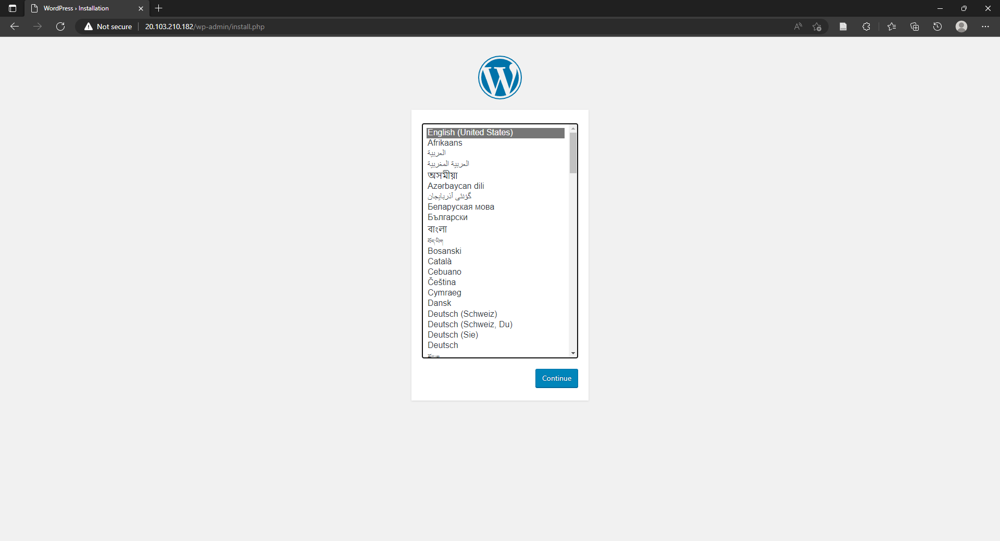
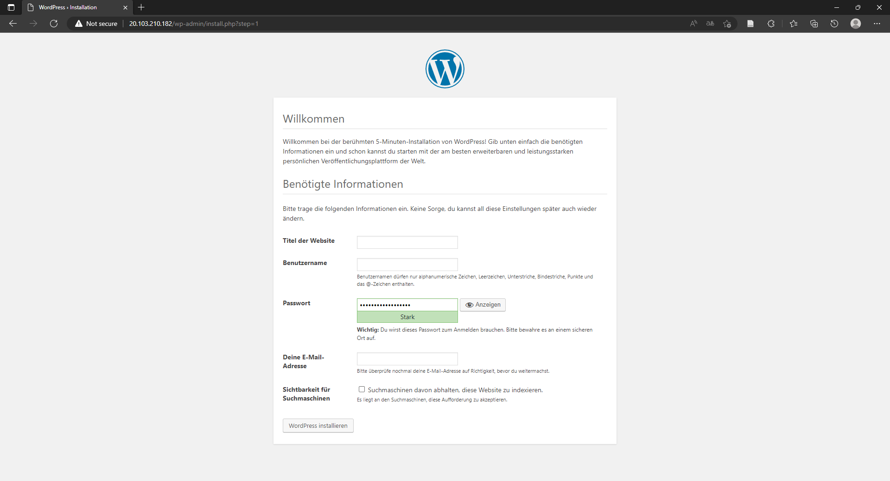

# Lab 4

Task for Lab 4:
- Set up, configurate and deploy WordPress and MySQL on an Azure Kubernetes Service (AKS) cluster.

## Prerequisite

Before starting, make sure you have [Azure CLI installed](https://learn.microsoft.com/en-us/cli/azure/install-azure-cli-windows?tabs=azure-cli).

## Sign in to Azure

To start working with Azure CLI, sign in with your Azure credentials.
```console
az login
```
> **Note** <br>
> If you have multiple Azure subscriptions, you can use `az account set --subscription SubscriptionName`. Choose the subscription you want to use and replace SubscriptionName with your subscription name. You can also use your subscription ID instead of your subscription name. 

## Verify Azure resource providers

Verify _Microsoft.OperationsManagement_ and _Microsoft.OperationalInsights_ providers are registered on your subscription. These are Azure resource providers required to support [Container insights](https://learn.microsoft.com/en-us/azure/azure-monitor/containers/container-insights-overview). To check the registration status, run the following commands:
```console
az provider show -n Microsoft.OperationsManagement -o table
az provider show -n Microsoft.OperationalInsights -o table
```
> **Note** <br>
> If they are not registered, register _Microsoft.OperationsManagement_ and _Microsoft.OperationalInsights_ using the following commands: `az provider register --namespace Microsoft.OperationsManagement` and `az provider register --namespace Microsoft.OperationalInsights`

## Create resource group

When you deploy something, you can specify a resource group to contain the resources. The following example creates a resource group named _myResourceGroup_ in the _West Europe_ location. Create the resource group with the following command:
```console
az group create --name myResourceGroup --location "West Europe"
```

## Create AKS cluster

Now, create an AKS cluster using `az aks create` with the `--enable-addons monitoring` and `--enable-msi-auth-for-monitoring` parameter to enable Azure Monitor Container insights with managed identity authentication. The following example creates a cluster named _myAKSCluster_ with one node and enables a system-assigned managed identity:
```console
az aks create -g myResourceGroup -n myAKSCluster --enable-managed-identity --node-count 1 --enable-addons monitoring --enable-msi-auth-for-monitoring  --generate-ssh-keys
```
> **Note** <br>
> After a few minutes, the command completes and returns JSON-formatted information about the cluster.

## Connect to the cluster

To manage a Kubernetes cluster, use the Kubernetes command-line client`kubectl`.
1. Install `kubectl` locally using:	
    ```console
	az aks install-cli
    ```
	> **Note** <br>
	> If you get the error response from the console: Please add "PATH\.azure-kubelogin" to your search PATH so the `kubelogin.exe` can be found. You have to follow the instructions of the console.

2. Configure `kubectl` to connect to your Kubernetes cluster. The following command can be used: 	
    ```console
	az aks get-credentials --resource-group myResourceGroup --name myAKSCluster
	```

4. After that verify the connection to your cluster using the `kubectl get` command. This command returns a list of the cluster nodes.
    ```console
	kubectl get nodes
    ```

## Deploy the application

To deploy WordPress and MySQL, two manifest files must be created:
- `mysql-deployment.yaml` 
- `wordpress-deployment.yaml`

1. Create the `mysql-deployment.yaml` file. The following manifest describes a single-instance MySQL Deployment.
	```yaml
	apiVersion: v1
	kind: Service
	metadata:
	  name: wordpress-mysql
	  labels:
	    app: wordpress
	spec:
	  ports:
	    - port: 3306
	  selector:
	    app: wordpress
	    tier: mysql
	  clusterIP: None
	---
	apiVersion: v1
	kind: PersistentVolumeClaim
	metadata:
	  name: mysql-pv-claim
	  labels:
	    app: wordpress
	spec:
	  accessModes:
	    - ReadWriteOnce
	  resources:
	    requests:
	      storage: 20Gi
	---
	apiVersion: apps/v1
	kind: Deployment
	metadata:
	  name: wordpress-mysql
	  labels:
	    app: wordpress
	spec:
	  selector:
	    matchLabels:
	      app: wordpress
	      tier: mysql
	  strategy:
	    type: Recreate
	  template:
	    metadata:
	      labels:
	        app: wordpress
	        tier: mysql
	    spec:
	      containers:
	      - image: mysql:5.6
	        name: mysql
	        env:
	        - name: MYSQL_ROOT_PASSWORD
	          valueFrom:
	            secretKeyRef:
	              name: mysql-pass
	              key: password
	        ports:
	        - containerPort: 3306
	          name: mysql
	        volumeMounts:
	        - name: mysql-persistent-storage
	          mountPath: /var/lib/mysql
	      volumes:
	      - name: mysql-persistent-storage
	        persistentVolumeClaim:
	          claimName: mysql-pv-claim
	```
	          
2. Create the `wordpress-deployment.yaml`  file. The following manifest describes a single-instance WordPress Deployment.

	```yaml
	apiVersion: v1
	kind: Service
	metadata:
	  name: wordpress
	  labels:
	    app: wordpress
	spec:
	  ports:
	    - port: 80
	  selector:
	    app: wordpress
	    tier: frontend
	  type: LoadBalancer
	---
	apiVersion: v1
	kind: PersistentVolumeClaim
	metadata:
	  name: wp-pv-claim
	  labels:
	    app: wordpress
	spec:
	  accessModes:
	    - ReadWriteOnce
	  resources:
	    requests:
	      storage: 20Gi
	---
	apiVersion: apps/v1
	kind: Deployment
	metadata:
	  name: wordpress
	  labels:
	    app: wordpress
	spec:
	  selector:
	    matchLabels:
	      app: wordpress
	      tier: frontend
	  strategy:
	    type: Recreate
	  template:
	    metadata:
	      labels:
	        app: wordpress
	        tier: frontend
	    spec:
	      containers:
	      - image: wordpress:4.8-apache
	        name: wordpress
	        env:
	        - name: WORDPRESS_DB_HOST
	          value: wordpress-mysql
	        - name: WORDPRESS_DB_PASSWORD
	          valueFrom:
	            secretKeyRef:
	              name: mysql-pass
	              key: password
	        ports:
	        - containerPort: 80
	          name: wordpress
	        volumeMounts:
	        - name: wordpress-persistent-storage
	          mountPath: /var/www/html
	      volumes:
	      - name: wordpress-persistent-storage
	        persistentVolumeClaim:
	          claimName: wp-pv-claim
	```
3.  Now setup a password for the MySQL database. To do this enter the following command and replace YOURPASSWORDHERE with your own password:
	```console
	kubectl create secret generic mysql-pass --from-literal=password=YOURPASSWORDHERE
	```	
	> **Note** <br>
	> The secret is now created. To ensure it was created you can run the `kubectl get secrets` command.

4. Change to your directory, where you created the `mysql-deployment.yaml` and `wordpress-deployment.yaml` file. 

5. Next create the MySQL Pod and service by running the following command:
	```console
	kubectl apply -f mysql-deployment.yaml
	```	
	> **Note** <br>
	> You could also use `kubectl create mysql-deployment.yaml`instead of apply to create the MySQL pod 		and service.  `kubectl apply` essentially equals to `kubectl create` + `kubectl replace`. In order to update an object after it has been created using `kubectl create` you would need to run `kubectl replace`.
	
	> **Tip** <br>
	> You can check to ensure the persistent volume was created by running the `kubectl get pvc` command. You can also run `kubectl get pods` to verify that the MySQL pod is running.
	
6. Next create the WordPress Pod and service by running the following command:
	```console
	kubectl apply -f wordpress-deployment.yaml
	```	
	
	> **Tip** <br>
	> You can check to ensure the persistent volume was created by running the `kubectl get pvc` command. 

7. In order to see that the services are running properly and find out the external IP you can run the following command:
	```console
	kubectl get services
	```
	> **Note** <br>
	> To see just the WordPress service, you can use `kubectl get services wordpress`.

## Bring up WordPress in a web browser

At this point, WordPress should be running. Now you can open the external IP in a web browser.

<p align="center">

</p>

<p align="center">

</p>

## Start AKS cluster

> **Warning** <br>
> Running an Azure Kubernetes Service cluster is not free! To avoid Azure charges, stop or delete unnecessary resources. Use the  `az aks stop` or the `az group delete` command.

You can use the `az aks start` command to start a stopped AKS cluster. The following example starts a cluster named _myAKSCluster_:
```console
az aks start --name myAKSCluster --resource-group myResourceGroup
```

>**Note** <br>
> You can verify when your cluster has started by using the `az aks show` command. The `powerState` should show `Running`.  If the `provisioningState` shows `Starting` that means your cluster hasn't fully started yet.

## Stop AKS cluster

You can use the `az aks stop` command to stop a running AKS cluster. The following example stops a cluster named _myAKSCluster_:
```console
az aks stop --name myAKSCluster --resource-group myResourceGroup
```

## Delete AKS cluster

If you want to delete your created AKS cluster and to avoid Azure charges, you can clean up your unnecessary resources. Use the `az group delete` command to remove the resource group, container service, and all related resources.
```console
az group delete --name myResourceGroup --yes --no-wait
```

## Screenshots

In the screenshots folder you will find some screenshots of the console inputs. You will also find screenshots of the Azure portal etc.

## Useful Links

* [Deploy MySQL and WordPress on Azure Kubernetes Service (AKS)](https://www.buchatech.com/2019/01/deploy-mysql-and-wordpress-on-azure-kubernetes-service-aks/)
* [Example: Deploying WordPress and MySQL with Persistent Volumes](https://kubernetes.io/docs/tutorials/stateful-application/mysql-wordpress-persistent-volume/)
* [Quickstart: Deploy an Azure Kubernetes Service cluster using the Azure CLI](https://learn.microsoft.com/en-us/azure/aks/learn/quick-kubernetes-deploy-cli)
* [Stop and Start an Azure Kubernetes Service (AKS) cluster](https://learn.microsoft.com/en-us/azure/aks/start-stop-cluster?tabs=azure-cli)
* [az aks Commands](https://learn.microsoft.com/en-us/cli/azure/aks?view=azure-cli-latest)

## Experience

First of all, I found very helpful tutorials to solve this task, see Useful Links section. 

I struggled with PowerShell, because PowerShell cannot recognize a path with spaces between. The solution was to set the path between quotation marks.  

After using `az aks install-cli`, I got an error response from the console: Please add “PATH.azure-kubelogin” to your search PATH so the `kubelogin.exe` can be found. The solution was to follow the displayed instructions of the console.